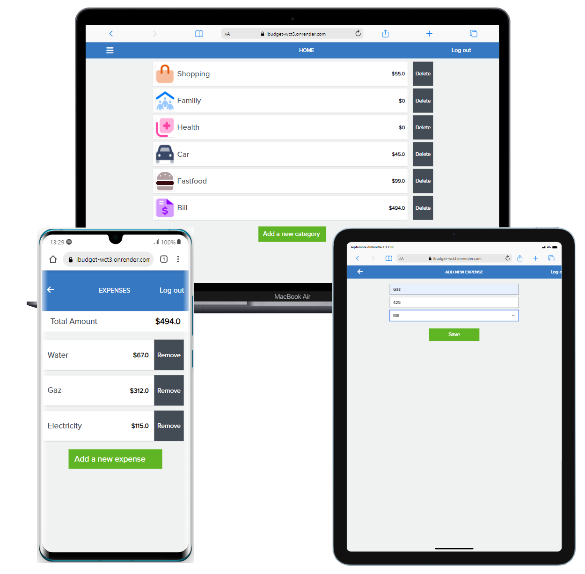

  
  
     
  <h2><b>i-budget</b></h2>

  

# 📗 Table of Contents
- [📖 About the Project](#about-project)
  - [🛠 Built With](#built-with)
    - [Tech Stack](#tech-stack)
    - [Key Features](#key-features)
  - [🚀 Live Demo](#live-demo)
- [💻 Getting Started](#getting-started)
  - [Setup](#setup)
  - [Prerequisites](#prerequisites)
  - [Install](#install)
  - [Usage](#usage)
  - [Run tests](#run-tests)
  - [Deployment](#triangular_flag_on_post-deployment)
- [👥 Authors](#authors)
- [🔭 Future Features](#future-features)
- [🤝 Contributing](#contributing)
- [⭐️ Show your support](#support)
- [🙏 Acknowledgements](#acknowledgements)
<!-- - [❓ FAQ (OPTIONAL)](#faq) -->
- [📝 License](#license)

 

# 📖 i-budget 
> i-budget is a mobile web application where you can manage your budget. You have a list of transactions associated with a category, so that you can see how much money you spent and on what. 
 

## 🛠 Built With 
- Ruby
- Rails
- PostgreSQL
- Linters

### Tech Stack 

  
Client

  <ul>
    <li><a href="https://www.ruby-lang.org/en/">Ruby</a></li>
    <li><a href="https://guides.rubyonrails.org/">Rails</a></li>
    <li><a href="https://www.postgresql.org/">PostgreSQL</a></li>
  </ul>

 

### Key Features 
- Sign up and log in pages.
- Home page.
- Transactions page.
- "Add a new category" page.
- "Add a new transaction" page.
- Testing.

(<a href="#readme-top">back to top</a>)

## 🚀 Live Demo 
>[Live Demo](https://ibudget-wct3.onrender.com/)

> [Video Presentation](https://www.loom.com/share/5e12b1670321432d8a1b5490043fd593?sid=7660ce17-624d-455d-a604-c291d6c086e5)

(<a href="#readme-top">back to top</a>)

## 💻 Getting Started 
To get a local copy up and running, follow these steps:

### Prerequisites
In order to run this project you need:
- A browser of you choice.
- A text editor of your choice.
- Install ruby gem and depencies on your local system
- Install Postgresql

### Insall
- bundle install
- rails s

### Setup

Clone this repository to your desired folder:
> - git clone https://github.com/momo-87/i-budget.git
> - cd recipe-app
### Usage
- rails s to run the project locally
- open the [Live Demo](https://ibudget-wct3.onrender.com/)
### Run tests
Run the following script and style test:
> - rspec spec

(<a href="#readme-top">back to top</a>)

### Deployment
> The project is already deployed on rende [Live Demo](https://ibudget-wct3.onrender.com/).

## 👥 Author 
👤 Christian Romuald MOMO TONFACK
- GitHub: [@githubhandle](https://github.com/Momo-87)
- LinkedIn: [LinkedIn](https://www.linkedin.com/in/christian-momo/)
- Twitter: [@twitterhandle](https://twitter.com/Momo_yde)

(<a href="#readme-top">back to top</a>)

## 🔭 Future Features 
- Deploy the application.

(<a href="#readme-top">back to top</a>)

## 🤝 Contributing 
> Contributions, issues, and feature requests are welcome!
Feel free to check the [issues page](https://github.com/momo-87/i-budget/issues).

(<a href="#readme-top">back to top</a>)

## ⭐️ Show your support 
>If you like this project just give it a star ⭐️.

(<a href="#readme-top">back to top</a>)

## 🙏 Acknowledgments 
>I would like to thank Microverse comnunity for their supports.
> 
I would like to thank <a href = "https://www.behance.net/gregoirevella"> Gregoire Vella on Behance.</a> the author of the original design.

(<a href="#readme-top">back to top</a>)

## 📝 License 
>This project is [MIT](./LICENSE) licensed.

(<a href="#readme-top">back to top</a>)

